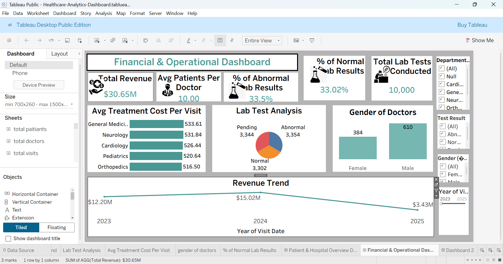

# Healthcare Analytics Dashboard

## Overview

The Healthcare Analytics Dashboard is an interactive Business Intelligence project developed using Tableau and SQL to analyze healthcare operations, financial performance, patient visits, doctor demographics, and laboratory test results.

This dashboard helps healthcare administrators, hospital management teams, and decision-makers monitor key performance indicators (KPIs), identify operational trends, and improve healthcare service efficiency.

---

## Project Objectives

- Analyze hospital financial performance.
- Monitor patient visits and treatment costs.
- Evaluate laboratory test outcomes.
- Track doctor demographics.
- Identify operational trends and performance metrics.
- Support data-driven healthcare decision-making.

---

## Tools & Technologies

- Tableau
- Data Visualization
- Business Intelligence
- Data Analytics

---

## Dataset Information

The dataset includes healthcare-related information such as:

- Patient Records
- Doctor Information
- Department Details
- Visit Dates
- Revenue Data
- Treatment Costs
- Lab Test Results
- Gender Information
- Hospital Operations Metrics

---

## Dashboard Features

### KPI Cards

- Total Revenue: $30.65M
- Average Patients Per Doctor: 10
- Abnormal Lab Results: 33.5%
- Normal Lab Results: 33.02%
- Total Lab Tests Conducted: 10,000

---

## Visualizations

### Average Treatment Cost Per Visit
Displays treatment costs across hospital departments:

- General Medicine
- Neurology
- Cardiology
- Pediatrics
- Orthopedics

### Lab Test Analysis
Analyzes lab test outcomes:

- Normal
- Abnormal
- Pending

### Gender of Doctors
Shows the distribution of male and female doctors.

### Revenue Trend Analysis
Tracks revenue performance across different years.

### Department Analysis
Allows comparison of performance across hospital departments.

---

## Interactive Filters

Users can filter dashboard insights based on:

- Department
- Test Result
- Gender
- Visit Year

---

## Key Insights

- Generated total revenue of $30.65M.
- Conducted 10,000 lab tests.
- Average of 10 patients per doctor.
- Approximately one-third of lab results are abnormal.
- Revenue peaked in 2024 before declining in 2025.
- Male doctors represent a larger share of the workforce compared to female doctors.

---

## Project Workflow

1. Data Collection
2. Data Cleaning and Preparation
3. SQL Analysis
4. Tableau Dashboard Development
5. KPI Creation
6. Visualization Design
7. Business Insight Generation

---

## Dashboard Preview

### Healthcare Analytics Dashboard

---

## Business Benefits

- Improves hospital performance monitoring.
- Supports resource allocation decisions.
- Enhances patient care analysis.
- Helps identify high-cost treatment areas.
- Enables data-driven healthcare management.
- Provides actionable operational insights.

---

## Future Enhancements

- Predictive Healthcare Analytics
- Patient Readmission Analysis
- Doctor Performance Metrics
- Disease Trend Forecasting
- Real-Time Dashboard Integration

---

## Author

Mohd Shaibaz

Aspiring Data Analyst

Skills:

- Tableau
- Data Analytics
- Business Intelligence
